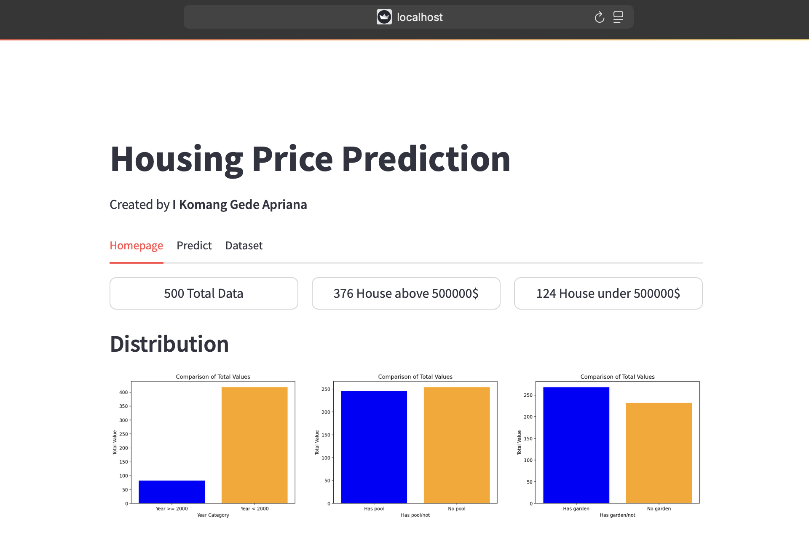

# 🏠 Housing Price Prediction Model



A machine learning application that predicts house prices based on various features using Linear Regression. Built with scikit-learn and Streamlit for an interactive user interface.

## 📊 Features Used for Prediction

The model considers the following features to make accurate price predictions:

- **Square_Feet**: Property area in square meters
- **Num_Bedrooms**: Number of bedrooms
- **Num_Bathrooms**: Number of bathrooms
- **Num_Floors**: Number of floors
- **Year_Built**: Construction year
- **Has_Garden**: Garden availability (Yes/No)
- **Has_Pool**: Swimming pool availability (Yes/No)
- **Garage_Size**: Garage area in square meters
- **Location_Score**: Neighborhood quality score (0-10)
- **Distance_to_Center**: Distance to city center in kilometers

## 🛠️ Project Structure

```
housing-price-regression/
├── .streamlit/
│   └── config.toml
├── sources/
│   ├── dataset.csv
│   ├── model.sav
│   ├── modeling.py
│   ├── preprocessing.py
│   └── scaler.sav
├── ui/
│   ├── dataset.py
│   ├── homepage.py
│   └── predict.py
├── venv/
├── .editorconfig
├── .gitignore
├── app.py
├── housing-price-regression.ipynb
├── README.md
└── requirements.txt
```

## 🚀 Getting Started

### Prerequisites

- Python 3.8 or higher
- pip package manager

### Installation

1. Clone the repository:
```bash
git clone https://github.com/yourusername/housing-price-regression.git
cd housing-price-regression
```

2. Create and activate virtual environment:
```bash
python -m venv venv
source venv/bin/activate  # On Windows: venv\Scripts\activate
```

3. Install required packages:
```bash
pip install -r requirements.txt
```

### Running the Application

1. Start the Streamlit app:
```bash
streamlit run app.py
```

2. Open your browser and navigate to `http://localhost:8501`

## 💻 Usage

The application provides three main pages:

1. **Homepage**: Overview of the project and model information
2. **Dataset**: View and explore the training data
3. **Predict**: Input house features and get price predictions

## 🔧 Model Details

- Algorithm: Linear Regression
- Framework: scikit-learn
- Preprocessing: Standard scaling for numerical features
- Features: 10 input features (both numerical and categorical)

## 🤝 Contributing

Contributions are welcome! Please feel free to submit a Pull Request.

## 📝 License

This project is licensed under the MIT License - see the LICENSE file for details.

## 👥 Contact

I Komang Gede Apriana - [gedeapriana36@gmail.com.com](mailto:gedeapriana36@gmail.com)
Project Link: [https://github.com/gdapriana/housing-price-regression](https://github.com/gdapriana/housing-price-regression)